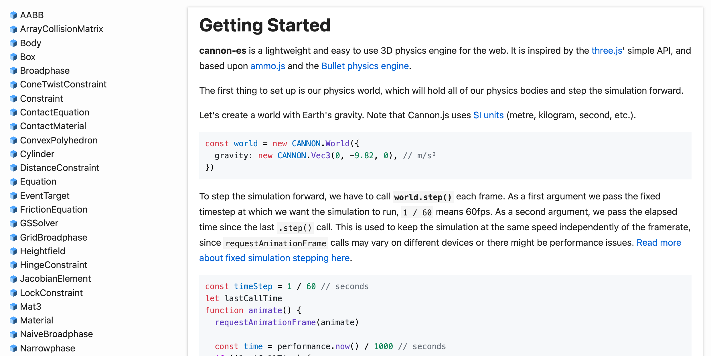
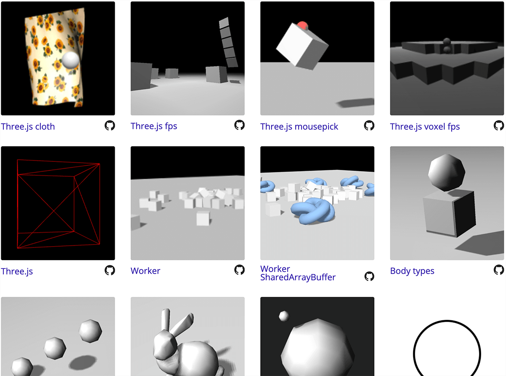

# cannon-es

This is a maintained fork of [cannon.js](https://github.com/schteppe/cannon.js), originally created by Stefan Hedman [@schteppe](https://github.com/schteppe).

It's a type-safe flatbundle (esm and cjs) which allows for **tree shaking** and usage in modern environments.

These minor changes and improvements were also made:

- These PRs from the original repo were merged: [schteppe/cannon.js#433](https://github.com/schteppe/cannon.js/pull/433), [schteppe/cannon.js#430](https://github.com/schteppe/cannon.js/pull/430), [schteppe/cannon.js#418](https://github.com/schteppe/cannon.js/pull/418), [schteppe/cannon.js#360](https://github.com/schteppe/cannon.js/pull/360), [schteppe/cannon.js#265](https://github.com/schteppe/cannon.js/pull/265), [schteppe/cannon.js#392](https://github.com/schteppe/cannon.js/pull/392), [schteppe/cannon.js#424](https://github.com/schteppe/cannon.js/pull/424)
- The `ConvexPolyhedron` constructor now accepts an object instead of a list of arguments. [#6](https://github.com/pmndrs/cannon-es/pull/6)
- The `Cylinder` is now oriented on the Y axis. [#30](https://github.com/pmndrs/cannon-es/pull/30)
- The `type` property of the `Cylinder` is now equal to `Shape.types.CYLINDER`. [#59](https://github.com/pmndrs/cannon-es/pull/59)
- `Body.applyImpulse()` and `Body.applyForce()` are now relative to the center of the body instead of the center of the world [86b0444](https://github.com/schteppe/cannon.js/commit/86b0444c93356aeaa25dd1af795fa162574c6f4b)
- Sleeping bodies now wake up if a force or an impulse is applied to them [#61](https://github.com/pmndrs/cannon-es/pull/61)
- Added a property `World.hasActiveBodies: boolean` which will be false when all physics bodies are sleeping. This allows for invalidating frames when physics aren't active for increased performance.
- Add support for [Trigger bodies](https://pmndrs.github.io/cannon-es/examples/trigger). [#83](https://github.com/pmndrs/cannon-es/pull/83)
- Deprecated properties and methods have been removed.
- The [original cannon.js debugger](https://github.com/schteppe/cannon.js/blob/master/tools/threejs/CannonDebugRenderer.js), which shows the wireframes of each body, has been moved to its own repo [cannon-es-debugger](https://github.com/pmndrs/cannon-es-debugger).

If instead you're using three.js in a **React** environment with [react-three-fiber](https://github.com/pmndrs/react-three-fiber), check out [use-cannon](https://github.com/pmndrs/use-cannon)! It's a wrapper around cannon-es.

## Installation

```
yarn add cannon-es
```

## Usage

```js
import { World } from 'cannon-es'

// ...
```

or, if you're using webpack, you can import it like this while still taking advantage of tree shaking:

```js
import * as CANNON from 'cannon-es'

// ...
```

## [Documentation](https://pmndrs.github.io/cannon-es/docs/)

[](https://pmndrs.github.io/cannon-es/docs/)

## [Examples](https://pmndrs.github.io/cannon-es/)

[](https://pmndrs.github.io/cannon-es/)

#### TO DO:

- Fix Octree `as any` assertions, and remove `as any` type assertions wherever possible
- Remove use of defined assertion (!) where possible (profile performance to ensure no degradation)
- Convert to abstract classes where possible (Equation, Solver, etc.?)
- V-HACD support (https://github.com/pmndrs/use-cannon/issues/35#issuecomment-600188994)
- Explore performance enhancements:
  - https://github.com/RandyGaul/qu3e
  - https://github.com/RandyGaul/cute_headers
  - https://github.com/TheRohans/dapao/issues?q=is%3Aissue
  - https://github.com/swift502/Sketchbook/commits/master/src/lib/cannon/cannon.js
  - https://github.com/schteppe/cannon.js/pulls
